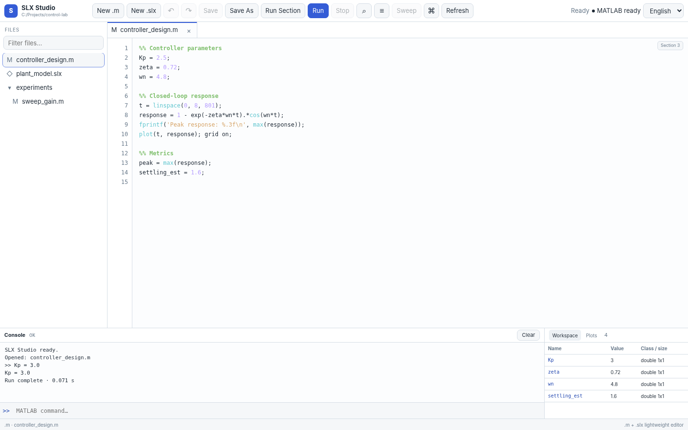
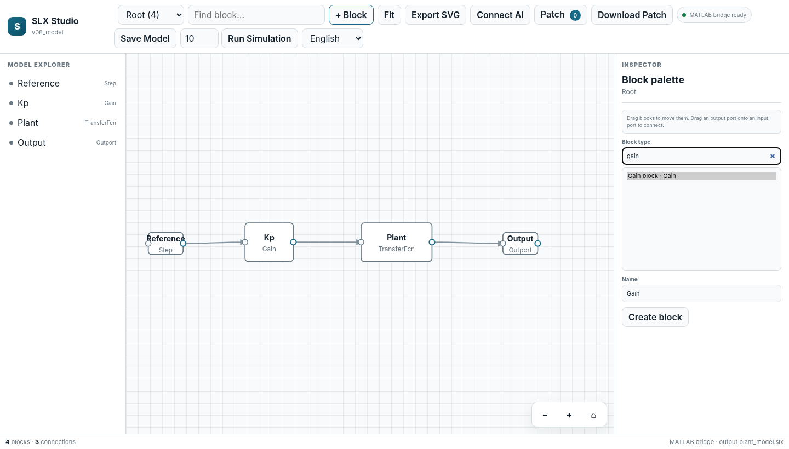

<div align="center">

# SLX Studio

### A lightweight editor for MATLAB `.m` scripts and Simulink `.slx` models.

**Edit code. Edit block diagrams. Run both through your local MATLAB installation.**

[中文](README.zh-CN.md) · [Quick start](#quick-start) · [M editor](#m-editor) · [SLX editor](#slx-editor) · [Desktop](#desktop-app) · [AI](#optional-ai-assistant)

</div>



> **Status: v1.0.0 Beta 2.** SLX Studio is now a lightweight `.m` + `.slx` engineering IDE: multi-tab editing, section execution, a MATLAB Command Window with shared workspace state, editable workspace variables, cancellable script/Simulink/sweep jobs, MATLAB figures, SimulationOutput plots, parameter sweeps, crash-recovery drafts, project search and graphical SLX editing. MATLAB/Simulink is still required to execute `.m` files and to create, modify or simulate real `.slx` files.

## Why SLX Studio

SLX Studio is not trying to reproduce the full MATLAB desktop. It targets the small, frequent loop around a MATLAB/Simulink project:

```text
Project folder
├── controller.m   → edit → save → run → console + variables
└── controller.slx → edit diagram → save → simulate
```

The same lightweight workbench can move between code and block diagrams without making AI or Git tooling the primary interface.

## Quick start

```bash
pip install -e .
slx-studio .
```

Open a file directly:

```bash
slx-studio controller.m
slx-studio controller.slx
```

If MATLAB is not on `PATH`:

```bash
slx-studio . --matlab "C:\\Program Files\\MATLAB\\R2026a\\bin\\matlab.exe"
```

or set `SLX_DIFF_MATLAB`.

The engineering CLI remains available:

```bash
slx-diff --version
slx-diff diff before.slx after.slx
```

## `.m` editor

The v1.0 Beta script editor supports a lightweight edit → run → inspect → iterate loop:

- multi-file tabs with dirty-state indicators,
- line numbers and lightweight MATLAB syntax highlighting,
- Ctrl/Cmd+S save, Shift+Ctrl/Cmd+S Save As and F5 whole-file run,
- **Ctrl/Cmd+Enter to run the current `%%` section or selection**, preserving source line numbers for errors,
- real cancellable background MATLAB jobs for `.m` execution,
- editor undo/redo and structured MATLAB error-line navigation,
- captured stdout/stderr plus a **Workspace Variables** panel,
- a MATLAB-style **Command Window** (`>>`) whose variables persist across background runs through a temporary session checkpoint,
- double-click editing for workspace variables using explicit MATLAB expressions,
- autosaved recovery drafts for dirty `.m` tabs, stored outside the project tree,
- embedded MATLAB Figure previews exported after execution,
- Quick Open (`Ctrl/Cmd+P`) and project-wide search (`Ctrl/Cmd+Shift+F`) across `.m` text and statically parsed `.slx` structure.

```text
controller.m *        analysis.m
────────────────────────────────────
  1  clear; clc
  2  Kp = 2.5;
  3  t = 0:0.01:5;
  4  y = 1-exp(-Kp*t);

Console                     Workspace Variables
MATLAB run complete         Kp  2.5   double 1x1
                            t   …     double 1x501
                            y   …     double 1x501
```


Script execution is always user-triggered. Connecting an AI provider does not grant it unrestricted MATLAB code execution.

## SLX editor



SLX Studio parses a model for lightweight viewing without MATLAB. When a local MATLAB/Simulink installation is available, the same canvas becomes an editor.

### Editor interactions in v1.0 Beta

- select blocks and edit exposed parameters,
- **drag blocks** on the canvas and persist their Simulink `Position`,
- keep signal paths visually attached while a block moves,
- render explicit input/output ports inferred from existing connections and **drag a specific output port onto a specific input port** to create a signal connection,
- add common blocks through a searchable Block Palette,
- rename and delete blocks,
- remove signal connections,
- save the model and run a simulation,
- undo/redo structural and parameter edits as one Workbench history,
- double-click a Subsystem block to navigate into its child system when present,
- plot supported numeric `SimulationOutput` timeseries/Dataset signals in the Workbench/Studio after simulation.

SLX undo/redo uses temporary model snapshots plus SHA-256 conflict checks. If another application changes the model on disk, SLX Studio refuses to overwrite that external change with a stale undo.

### Compatibility boundary

SLX Studio does **not** directly rewrite private `.slx` ZIP/XML internals for real edits. It sends validated operations to MATLAB/Simulink:

```text
set_param     add_block      delete_block
add_line      delete_line    save_system
sim
```

This keeps the browser UI lightweight while MATLAB remains responsible for serializing and executing real Simulink models.

### Safe starter palette

The current catalog includes common blocks such as Inport, Outport, Step, Constant, Gain, Sum, Saturation, Integrator, Discrete-Time Integrator, Transfer Function, Unit Delay, Mux, Scope and To Workspace. The catalog is extensible without hard-coding every block into the UI.

## Run, plots, sweeps and project navigation

The v1.0 Beta Workbench adds the small IDE conveniences that matter during iteration:

```text
Ctrl+Enter       run current %% section / selection
F5               run current .m file
Shift+F5         stop the active .m / SLX / sweep MATLAB job
Ctrl+Shift+P     Command Palette
Ctrl+P           Quick Open
Ctrl+Shift+F     search .m text + .slx blocks/parameters/signals
Ctrl+Shift+S     Save As
```

MATLAB Figures are captured after script execution and shown beside Workspace Variables. Supported numeric Simulink `timeseries` and `Simulink.SimulationData.Dataset` outputs are reduced to bounded plot payloads and rendered locally.

### Command Window and shared workspace

Scripts, sections, Command Window commands and variable edits share a session-scoped MATLAB workspace checkpoint. SLX Studio does **not** keep a heavyweight MATLAB desktop session embedded; instead, each explicit run inherits the checkpoint and writes the resulting user variables back. The checkpoint lives in a temporary session directory and is discarded when the Workbench closes.

```text
Run controller.m       -> Kp = 2.5
Command: Kp = 3        -> Kp = 3
Edit variable Kp = 4   -> Kp = 4
Run next section       -> sees Kp = 4
```

### Parameter Sweep

Select a block in an SLX model and open **Sweep**. Values can be entered as `1:0.5:5`, `3:1`, or comma-separated values. The sweep runs multiple simulations in the background, restores the original parameter, and returns bounded curves plus convenience metrics.

```text
Controller/Kp · Gain
1 : 0.5 : 5
      ↓
9 simulations
      ↓
overlaid response curves + final/max/RMS/settling estimate
```

Sweep metrics are review/iteration aids, not formal control-system verification.

## Create files

From the Workbench toolbar:

```text
New .m    → create and edit a MATLAB script
New .slx  → ask local MATLAB to create a real blank Simulink model
```

A new SLX model can then be built graphically or from an optional validated AI blueprint.

## Desktop app

Install the optional desktop shell:

```bash
pip install -e ".[desktop]"
slx-studio
```

With `pywebview`, the Workbench opens as a desktop window; otherwise it can fall back to the system browser.

### Windows EXE

`.github/workflows/build-windows.yml` is configured to build both a portable app and an installer on `windows-latest` whenever a version tag is pushed:

```text
SLXStudio.exe
SLX-Studio-Setup-x64.exe
```

The installer is per-user and offers **opt-in** desktop shortcut plus `.m` / `.slx` file associations; those associations are not enabled silently. End users of either Windows artifact do not need Python installed. MATLAB/Simulink is still required for actual script execution and real SLX writes/simulation.

## Optional AI assistant

AI is a helper layer, not the product shell. Built-in BYOK presets include OpenAI, DeepSeek, Kimi/Moonshot, MiniMax, GLM/Zhipu, Qwen/Alibaba Model Studio and custom OpenAI-compatible endpoints.

For SLX work, agents receive structured model tools and validated blueprints rather than an unrestricted MATLAB shell. The local REST API is documented in [`docs/agent-api.md`](docs/agent-api.md).

## Optional Git and review tools

The original `slx-diff` capabilities remain available:

```bash
slx-diff diff before.slx after.slx
slx-diff review before.slx after.slx
slx-diff context before.slx after.slx
slx-diff git-diff --base main --head HEAD
```

They provide semantic SLX differences, static downstream review hints and compact agent context without starting MATLAB.

## Architecture

```text
┌────────────────────────────────────────────────┐
│                SLX Studio Workbench            │
│                                                │
│ Project tree   .m tabs          .slx canvas    │
│                editor           inspector       │
│                console          block palette   │
│                variables        undo / redo     │
└───────────────────┬──────────────────┬─────────┘
                    │                  │
               text save/run      structured edits
                    │                  │
                    └────────┬─────────┘
                             ▼
                      local Python bridge
                             │
                ┌────────────┴────────────┐
                ▼                         ▼
         optional AI APIs            local MATLAB
         structured tools          run / edit / sim
```

## Safety boundary

- Static SLX parsing/viewing does not execute MATLAB.
- Running an `.m` script executes user code and is explicitly user-triggered.
- Real SLX writes/simulation require MATLAB and can inherit behavior from models MATLAB loads.
- Workspace file APIs are restricted to the selected project root.
- SLX edits use source/version checks instead of blindly overwriting the file.
- AI keys are not written into project files by SLX Studio.

See [`SECURITY.md`](SECURITY.md).

## Current limitations

v1.0 Beta is intentionally a small engineering editor, not a full MATLAB replacement.

- No full MATLAB language server, debugger, breakpoints or profiler yet.
- Workspace Variables supports explicit expression-based editing, but it is not yet a full spreadsheet-style array editor.
- Script, SLX simulation and parameter-sweep jobs are cancellable; Command Window commands are currently synchronous requests and are not independently stoppable.
- MATLAB stdout/stderr is collected when a job completes rather than streamed live.
- SLX editing now renders explicit ports found in the model, but dynamic/conditional port semantics and advanced Simulink object types need broader adapters.
- Stateflow, masks, variants, library links, model references and specialized toolbox blocks are not fully supported.
- Real MATLAB R2026a end-to-end validation must still be performed on a machine with MATLAB/Simulink installed.
- The included Windows workflow is configured for `SLXStudio.exe` plus `SLX-Studio-Setup-x64.exe`; this repository was prepared in a non-Windows build environment, so neither Windows binary is claimed as locally verified yet.

## Development

```bash
python -m pytest
```

The v1.0 Beta regression suite contains 53 tests covering SLX parsing/diff/review, patching, AI blueprints/providers, workspace isolation, section execution, cancellable MATLAB jobs, shared command-session checkpoints, workspace recovery, parameter sweeps and metrics, Figure payloads, SimulationOutput series extraction, project search, Save As, structured model edits/history, multi-port UI contracts and Workbench HTTP APIs.

## License

MIT. MATLAB and Simulink are products of MathWorks and are not bundled with this project.
